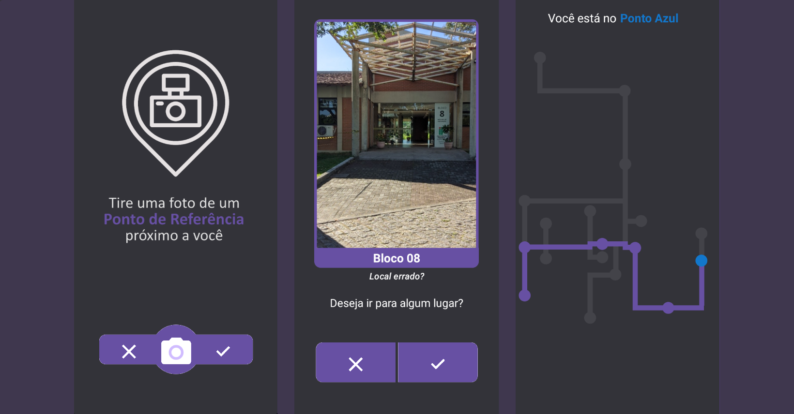

# Localif
## Image Recognition Native Mobile App

LocalIf ​​is an image recognition application specifically designed for IFES Campus Serra. With a comprehensive database, the program stores information about the various locations in the campus. Using two feature extractors, LocalIf ​​analyzes the photos sent by the user and determines the corresponding location. It also contains a pathfinder feature, which allows the user to find the shortest path between two locations.

### Project Status

🟢 Functional: Access to functionalities through code or application.

### Demo

### Features and Application Demo

- The user can take pictures inside the campus using the Android compatible mobile app built with Kotlin in Android Studio, allowing convenient use at any time.
- Through image processing performed in Python, all photos in the database and photos taken by the user are converted to PGM format, standardizing them in grayscale.
- The algorithm is mainly implemented in C language, using two main structures for handling information.
- The first structure is responsible for creating the database, where the characteristics of each image are extracted and stored individually in text files (.txt).
- Descriptor extraction is performed using two different methods: histogram and statistical shape extractor. Extracted descriptors are saved in separate folders.
- The second framework is focused on image recognition. The input image descriptors are extracted and Euclidean distances are calculated between it and the database image descriptors.
- The results are averaged weighted on each base image, providing greater accuracy.
- The structure is sorted based on the results, from lowest to highest value, displaying the five most similar locations and their corresponding images.
  Note: The usage of pictures from locations other than IFES Campus Serra can lead to inaccurate results, as the database is specific to that place.

### How to Use the C Algorithm using GCC

- The C algorithm is located in the `image-recovery` folder.
- The `image-recovery` folder contains the `img` folder, which contains the database images, and the `test` folder, which contains the test images.
- The `image-recovery` folder also contains the `main.c` file, which is the main file of the program.
- To run the program, you must have the `gcc` compiler installed on your computer.
- To compile the program, run the command `gcc main.c -o query`.
- To run the program, run the command `./query path/to/query/image`.

### Download the Android App

Download the app via [Google Drive](https://drive.google.com/file/d/1F_ip5eVP2huJprgRNnysRlwoz8d12-34/view?usp=sharing)

### Technologies Used

- C/C++
- Python
- Kotlin
- Java

### Project Developers

- [@Filipe Suhett Nogueira Silva](https://github.com/filipesuhett)
- [@Giovanna Scalfoni Sales](#)
- [@Jhonata Polito Demuner](https://github.com/jhonataplt)
- [@João Pedro Spinassé Viana](https://github.com/JP-76)
- [@Marllon Christiani dos Santos Ribeiro](https://github.com/Toiste)